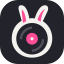
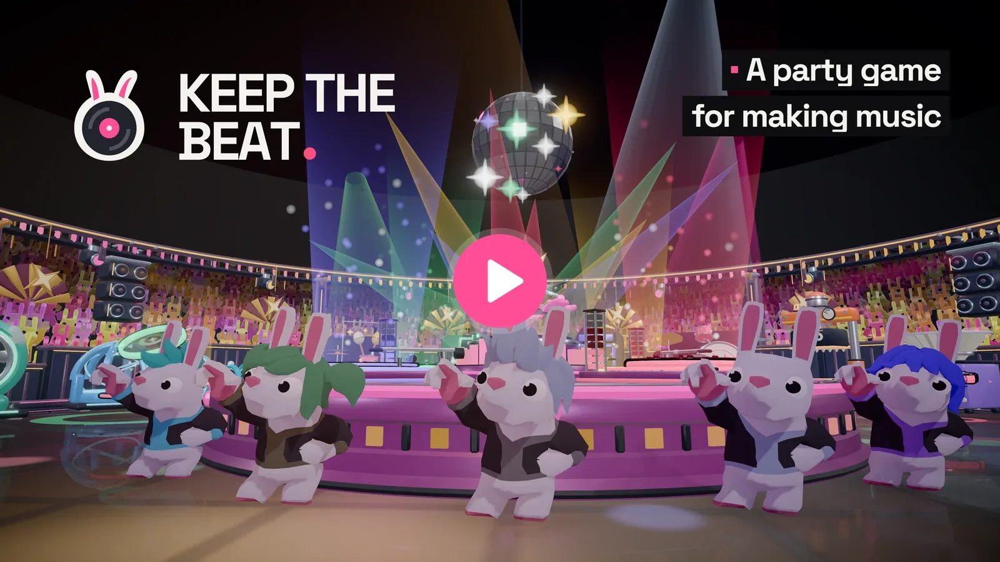
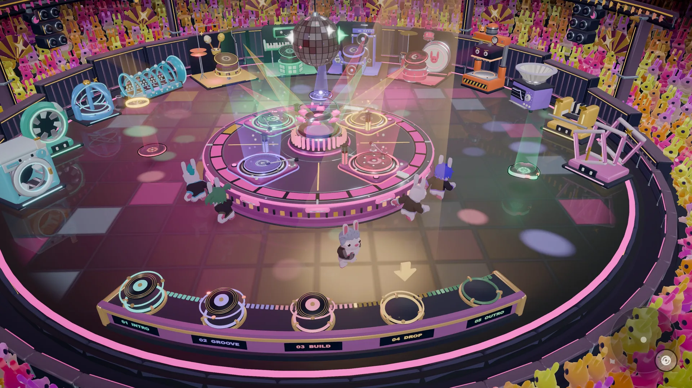
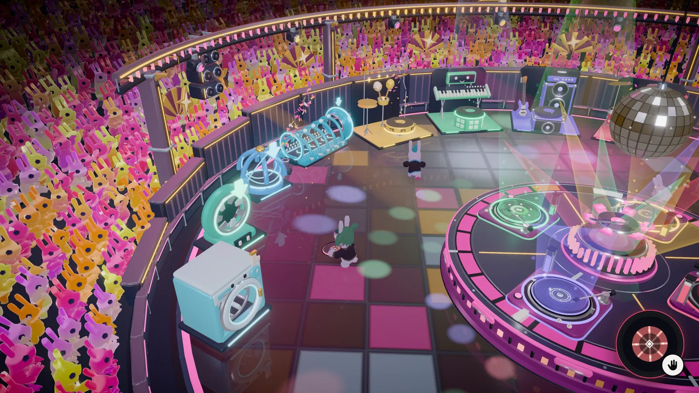
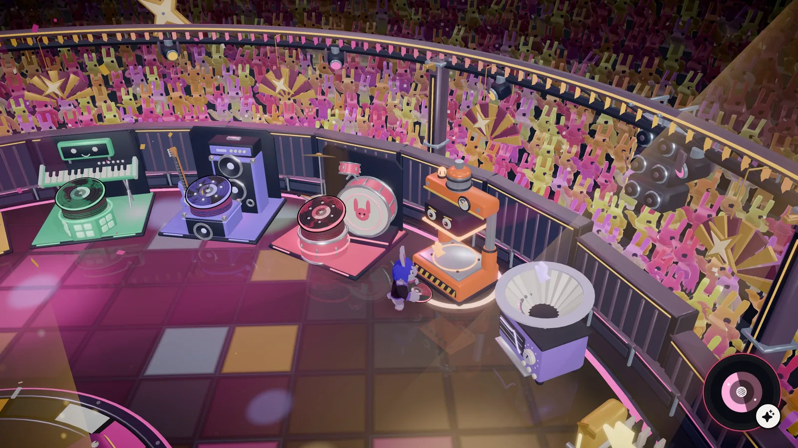
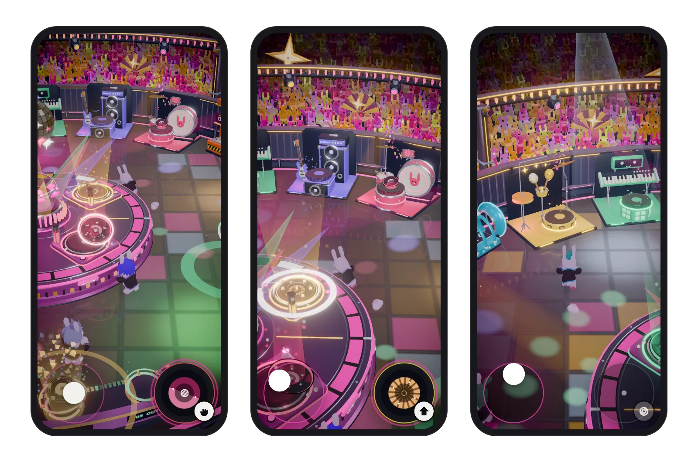

  
  <h1>Keep the Beat</h1>
  
<strong>A party game for making music.</strong>

  
Make a track with up to four friends, no skills needed, and take it home as an Audiotool project.

  

    
    
    
    
  

  

## How it plays

- Take records from the crates.
- Put effects on them if you like.
- Put them on the deck. Each one comes in on the beat.
- When a part sounds right, print it and move on to the next.
- When the show ends, send the track to your Audiotool account and keep going there.

Nine styles, from trip-hop to drum & bass. Every record is a loop from the Audiotool library.

## Screenshots

  
   
  
  

  

## Let's Build!

Made for [Let's Build!](https://www.audiotool.com/LetsBuild/), Audiotool's hackathon. Entered in:

- **Music Games**: you make music by playing, together.
- **Songstarter**: every show ends as an Audiotool project, ready to finish.
- **Connect**: phones and laptops in one room, writing into Audiotool.

## Credits

- Made by Wisla the Otter
- Loops: [Audiotool](https://www.audiotool.com)
- Characters and animations: [Quaternius](https://quaternius.com) (CC0)
- Disco ball: [Cough-E](https://opengameart.org/content/disco-ball-0) (CC0)
- Pitch shifting: [Signalsmith Stretch](https://github.com/Signalsmith-Audio/signalsmith-stretch) (MIT)
- 3D compression: Draco, Google (Apache 2.0)
- Font: [Space Grotesk](https://github.com/floriankarsten/space-grotesk), Florian Karsten (SIL OFL 1.1)
